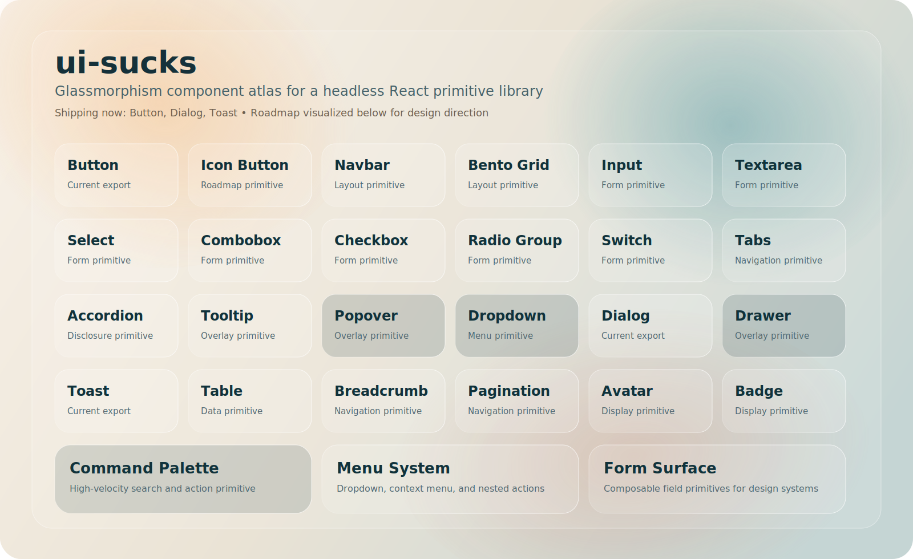

# ui-sucks

<p align="center">
  <a href="https://github.com/hari7261/ui-sucks/actions/workflows/ci.yml"></a>
  <a href="https://www.npmjs.com/package/ui-sucks"></a>
  <a href="https://www.npmjs.com/package/ui-sucks">
  
</a>
  <a href="LICENSE"></a>
  
  
</p>

<p align="center">
  Production-grade, tree-shakeable, headless React primitives built for real design systems.
</p>

<p align="center">
  
</p>

<p align="center">
  <sub>
    Documentation v1. The atlas visualizes the broader primitive vision. Shipping in <code>0.1.0</code> today: <strong>Button</strong>, <strong>Dialog</strong>, and <strong>Toast</strong>.
  </sub>
</p>

## Why ui-sucks

`ui-sucks` is intentionally small, strict, and boring in the right places:

- Headless by default, so your design system owns the presentation
- TypeScript-first with exported public types
- Tree-shakeable ESM and CJS builds
- Accessibility-focused behavior and ARIA wiring
- Minimal dependency surface with React and React DOM as peers
- Production-ready release flow with Changesets, CI, tests, and size budgets

## Current Production Components

### `Button`

- Headless native button primitive
- Supports toggle mode
- Controlled and uncontrolled APIs

### `Dialog`

- Composable `Dialog`, `DialogTrigger`, `DialogContent`, `DialogTitle`, `DialogDescription`, `DialogClose`, and `DialogPortal`
- Focus management and keyboard dismissal
- Modal and non-modal patterns

### `Toast`

- `ToastProvider`, `ToastViewport`, `Toast`, and `useToast`
- Queue-driven notifications
- Auto-dismiss with pause and resume interactions

## Component Atlas

The SVG atlas in this README is a visual roadmap that highlights the broader primitive direction for the repository, including:

- Button
- Icon Button
- Navbar
- Bento Grid
- Input
- Textarea
- Select
- Combobox
- Checkbox
- Radio Group
- Switch
- Tabs
- Accordion
- Tooltip
- Popover
- Dropdown
- Dialog
- Drawer
- Toast
- Table
- Breadcrumb
- Pagination
- Avatar
- Badge
- Command Palette

See [docs/COMPONENT-CATALOG.md](./docs/COMPONENT-CATALOG.md) for a clear split between shipped components and roadmap items.

## Installation

```bash
npm install ui-sucks
```

Peer dependencies:

```bash
npm install react react-dom
```

With `pnpm`:

```bash
pnpm add ui-sucks react react-dom
```

## Quick Start

```tsx
import {
  Button,
  Dialog,
  DialogClose,
  DialogContent,
  DialogDescription,
  DialogTitle,
  DialogTrigger,
  ToastProvider,
  ToastViewport,
  useToast,
} from 'ui-sucks';

function Demo() {
  const { push } = useToast();

  return (
    <>
      <Button
        toggle
        onPressedChange={(pressed) => {
          if (pressed) {
            push({
              title: 'Saved',
              description: 'Your changes were stored.',
            });
          }
        }}
      >
        Save
      </Button>

      <Dialog>
        <DialogTrigger>Open dialog</DialogTrigger>
        <DialogContent aria-label="Example dialog">
          <DialogTitle>Dialog title</DialogTitle>
          <DialogDescription>Accessible content with focus management.</DialogDescription>
          <DialogClose>Close</DialogClose>
        </DialogContent>
      </Dialog>

      <ToastViewport />
    </>
  );
}

export function App() {
  return (
    <ToastProvider>
      <Demo />
    </ToastProvider>
  );
}
```

## API Snapshot

### `Button`

```tsx
import { Button } from 'ui-sucks';

<Button toggle defaultPressed onPressedChange={(value) => console.log(value)}>
  Toggle me
</Button>;
```

Props:

- `toggle?: boolean`
- `pressed?: boolean`
- `defaultPressed?: boolean`
- `onPressedChange?: (pressed: boolean) => void`
- All native `button` props

### `Dialog`

```tsx
import {
  Dialog,
  DialogClose,
  DialogContent,
  DialogDescription,
  DialogTitle,
  DialogTrigger,
} from 'ui-sucks';

<Dialog defaultOpen={false} onOpenChange={(open) => console.log(open)}>
  <DialogTrigger>Open</DialogTrigger>
  <DialogContent aria-label="Settings">
    <DialogTitle>Settings</DialogTitle>
    <DialogDescription>Review your preferences.</DialogDescription>
    <DialogClose>Close</DialogClose>
  </DialogContent>
</Dialog>;
```

### `Toast`

```tsx
import { Button, ToastProvider, ToastViewport, useToast } from 'ui-sucks';

function Demo() {
  const { push } = useToast();

  return (
    <>
      <Button
        onClick={() =>
          push({
            title: 'Profile updated',
            description: 'All changes have been synced.',
          })
        }
      >
        Show toast
      </Button>
      <ToastViewport />
    </>
  );
}
```

## Repository Structure

```text
ui-sucks/
  src/
    components/
      button/
      dialog/
      toast/
    utils/
  tests/
  docs/
  examples/
    nextjs/
    vite/
```

## Documentation

- [Architecture](./docs/ARCHITECTURE.md)
- [Component Catalog](./docs/COMPONENT-CATALOG.md)
- [Roadmap](./docs/ROADMAP.md)
- [Publishing](./docs/PUBLISHING.md)
- [Contributing](./CONTRIBUTING.md)
- [Security Policy](./SECURITY.md)
- [Support](./SUPPORT.md)
- [Changelog](./CHANGELOG.md)

## Development

Install dependencies:

```bash
corepack pnpm install
```

Run the main scripts:

```bash
corepack pnpm dev
corepack pnpm lint
corepack pnpm typecheck
corepack pnpm test
corepack pnpm build
corepack pnpm size
corepack pnpm smoke
```

## Examples

Build the library first, or run the watch build in another terminal.

```bash
corepack pnpm build
corepack pnpm --filter vite-example dev
corepack pnpm --filter nextjs-example dev
```

## Release Process

Manual release:

```bash
npm login
corepack pnpm changeset
corepack pnpm version-packages
corepack pnpm smoke
corepack pnpm publish --access public
```

Automated release:

- Push changesets to `main`
- Configure the repository secret `NPM_TOKEN`
- Let the included GitHub Actions release workflow create the version PR or publish automatically

## Open Source Standards

- MIT licensed
- GitHub Actions CI
- Dependabot configuration
- Issue templates and pull request template
- CODEOWNERS and release workflow
- Smoke-tested local build

## Created By

`ui-sucks` was created by Hariom Kumar Pandit.
